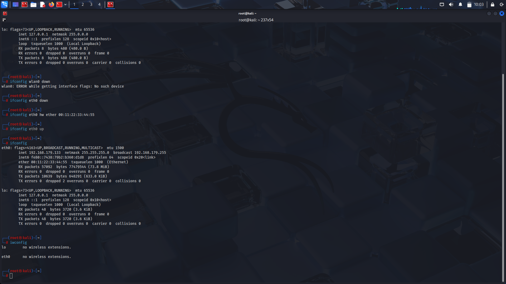

# Day 3 – Wireless Network Hacking Basics

✅ Completed Zaid Section 4  
✅ Learned how to spoof MAC address  
✅ Understood Monitor Mode vs Managed Mode  
📸 Screenshot: day3_wireless_mac.png

🧠 Learned:
- MAC address = device identity
- Monitor mode = sniffing/injection
- Adapters are crucial for Wi-Fi hacking
- 
